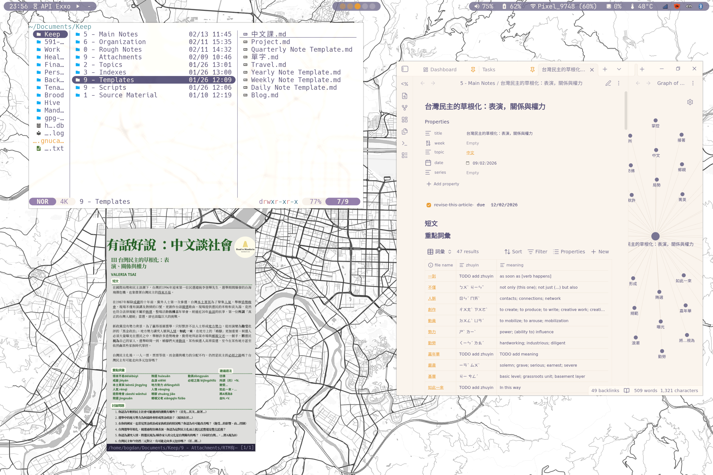

<h1 align="center">dotfiles</h1> 

## Why?

- A single repository that manages all my machines: Framework13, Steam Deck, other potential servers
- Must be able to:
    - apply configuration to any machine from my main Framework13 laptop
    - encrypt and store secrets I might need here
    - define common service definition and decide which machine gets which service / config
- Must be able to manage home directory, dotfiles and `~/.config` via this repository
    - dislike symlinking

## The current setup

System Management: [NixOS](https://nixos.org/)
- replacing all dotfile management with NixOS Home Manager

Gaming System Management: [Jovian-NixOS](https://github.com/Jovian-Experiments/Jovian-NixOS)

Syncthing for syncing all my devices

Terminal Emulator: [Ghostty](https://ghostty.org/)
- Zig-based terminal emulator
- uses platform-native UI & GPU acceleration (e.g. MacOS secure input for passwords)

Shell: [fish](https://fishshell.com/)
- completions
- sane scripting
- user friendly

Text Editor: [neovim](https://neovim.io/)
- vi-movements
- great community, loads of completions

Secrets Management: [sops-nix](https://github.com/Mic92/sops-nix)
- easy to manage AGE keys
- easy to integrate into my git repository (RIP me when we get quantum chips breaking encryption)

Code Completion & Language Servers: Neovim LSP & [Mason](https://github.com/williamboman/mason.nvim)
Colorscheme: [Rosé Pine](https://rosepinetheme.com/)

## Rice 米

