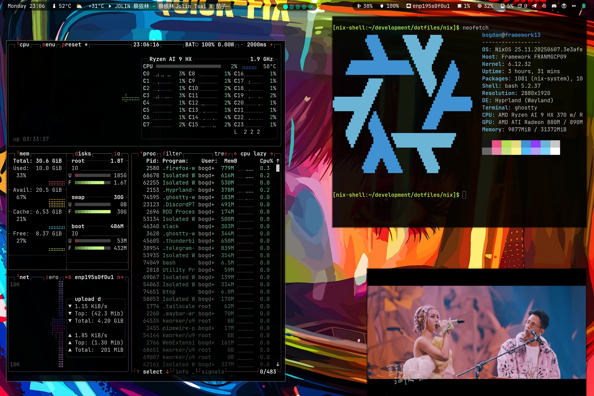

<h1 align="center">dotfiles</h1> 

## Why?

- keeping sanity while managing packages between a Linux & MacOS machine
- I like Nix
- I want to manage my home directory from a single reproducible pipeline

## The current setup

System Management: [NixOS](https://nixos.org/)
- replacing all dotfile management with NixOS Home Manager

Terminal Emulator: [Ghostty](https://ghostty.org/)
- Zig-based terminal emulator
- uses platform-native UI & GPU acceleration (e.g. MacOS secure input for passwords)

Shell: [fish](https://fishshell.com/)
- completions
- sane scripting
- user friendly

Text Editor: [neovim](https://neovim.io/)
- vi-movements
- great community, loads of plugins

Code Completion & Language Servers: Neovim LSP & [Mason](https://github.com/williamboman/mason.nvim)

## Rice 米

